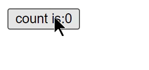
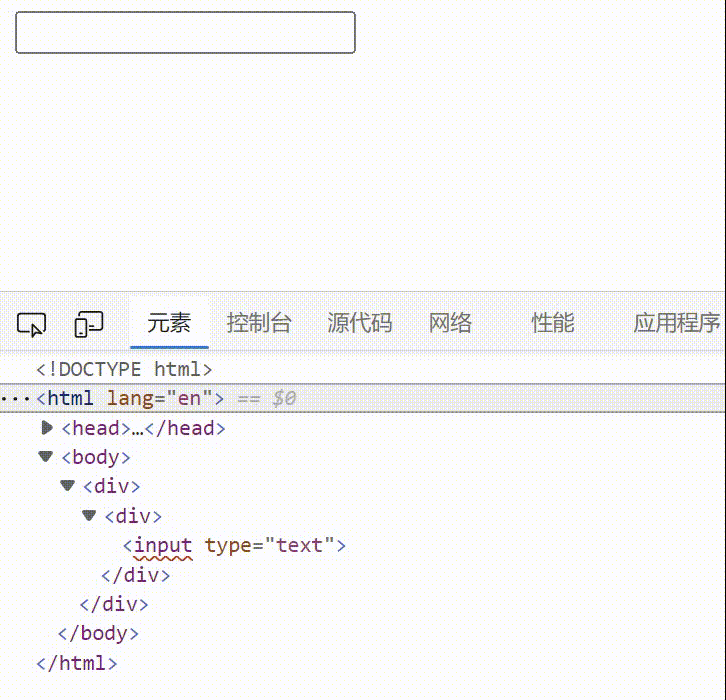
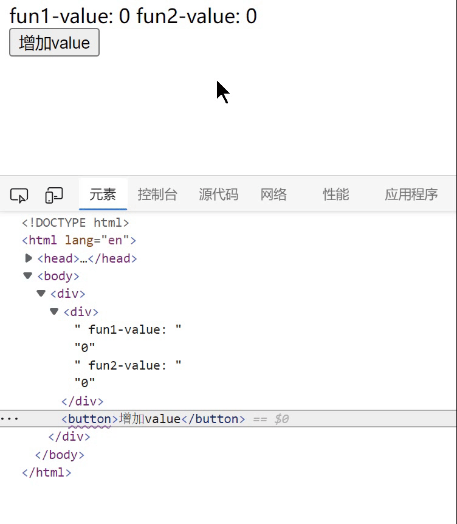
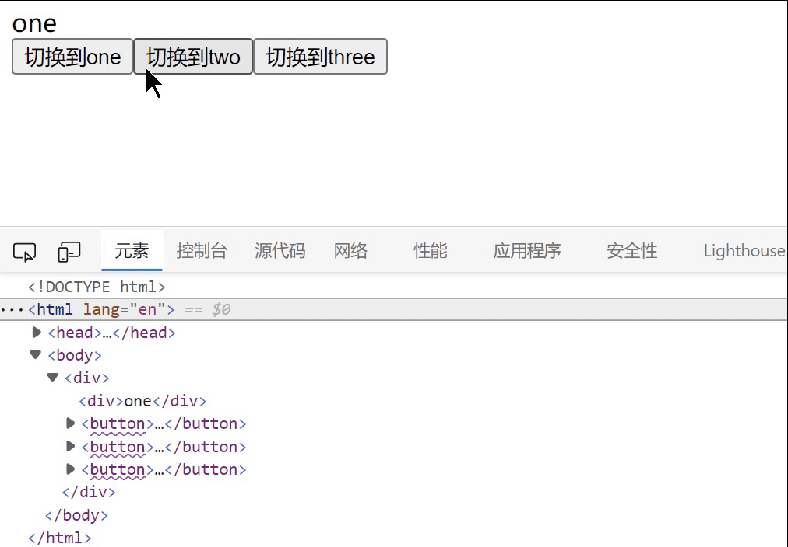

# Vact使用文档

（以下tode是已经实现的内容，文档还未写）


- [Vact使用文档](#vact使用文档)
  - [简介](#简介)
    - [整体架构思想](#整体架构思想)
    - [基本示例](#基本示例)
  - [渐进式](#渐进式)
  - [快速使用](#快速使用)
    - [配合webpack使用](#配合webpack使用)
      - [babel配置](#babel配置)
      - [直接使用demo环境](#直接使用demo环境)
  - [基础](#基础)
    - [创建应用](#创建应用)
    - [jsx语法](#jsx语法)
    - [响应式](#响应式)
    - [css样式绑定](#css样式绑定)
    - [元素节点响应绑定](#元素节点响应绑定)
    - [条件渲染](#条件渲染)
      - [条件渲染封装](#条件渲染封装)
    - [列表渲染](#列表渲染)
    - [事件绑定](#事件绑定)
    - [表单绑定](#表单绑定)
    - [监听器](#监听器)
    - [组件使用](#组件使用)
      - [声明并使用组件](#声明并使用组件)
        - [函数组件](#函数组件)
        - [类组件](#类组件)
      - [组件属性](#组件属性)
      - [组件插槽](#组件插槽)
        - [插槽](#插槽)
        - [具名插槽](#具名插槽)
      - [动态组件](#动态组件)
  - [结尾](#结尾)
    - [feture](#feture)

## 简介

**vact**，从名字就能看出，和**vue**还有**react**是少不了关系的，它是一款基于**vue**的响应式原理，以及**react**的**jsx**语法，并结合我自身的创新开发而来。当然，仅凭我一个人是无法将它维护的很好的，所以，我想借助它来向大家展示一下我自己的想法以及一些有趣的用法，那么接下来，请听我娓娓道来。


### 整体架构思想

这套框架的当然是具备声明式渲染和响应性的特点的，但不同的是，它并不是以比较diff为主，而是在一开始就确认好每一个活跃的dom节点的响应性，只有在一些比较严苛的条件（比如数组），才会启用diff进行比较。如果你不理解的话可以先接着往下看，这不影响你接下来的阅读。


### 基本示例

***注：下面的实例都是基于jsx语法，因为使用创建节点的api过于繁琐***

```jsx
import { state, createApp } from 'vactapp'

const count = state(0)
let app = <div>
  <button onClick={() => count.value++}>
    count is:{count.value}
  </button>
</div>

createApp(app).mount('#app')
```

**结果如下：**




## 渐进式

可以通过将节点挂载到真实dom来实现部分响应式代理


## 快速使用

如果使用创建节点的api去写的话会比较麻烦，目前推荐使用jsx并安装我写的babel解析插件

**|推荐直接在demo中运行！！！|（看下面）**


### 配合webpack使用


#### babel配置

**babel预设：**

`@babel/preset-env`

**babel插件：**

`babel-plugin-syntax-jsx   `（**识别jsx语法**）

`babel-plugin-transform-vact-jsx`（**翻译vact的babel**）


#### 直接使用demo环境

- master分支中demo文件中的demo1目录是简单的脚手架环境
- master分支中demo文件中的demo2目录是完善的webapck脚手架环境，可以解析包括其他各类资源

**运行demo：**`npm i yarn -g (如果有yarn请跳过)` `yarn install` `yarn dev`


## 基础


### 创建应用

```jsx
import { createApp } from 'vactapp'

const app = createApp(<div>Hello World!</div>)
app.mount('#app')
```


### jsx语法

这部分其实不需要我过多介绍，现在非常流行，而且网上也有教程

简单写一下

- html代码块中大括号里面用来写表达式

```jsx
const template = <div id={'app'}>
          {'hello'}
      </div>
```


- 事件以on开头，且代码块中为函数且只能为函数

```jsx
const button = <button onClick={(e) => console.log(e.target)}>确定</button>
```


### 响应式

想要实现响应式，必须首先创建响应式对象

```jsx
import { defineState, watch } from 'vactapp'

const data = defineState({
    count: 0
})

watch(() => data.count, (oldValue, newValue) => {
	console.log(oldValue, newValue)
})

data.count++ // 打印 0, 1
```


当然也可以创建基础属性的响应对象，但数值必须通过value访问

```jsx
import { state } from 'vactapp'

const count = state(0)

watch(() => count.value, (oldValue, newValue) => {
	console.log(oldValue, newValue)
})

count.value++ // 打印 0, 1
```


### css样式绑定

style可以为字符串或者对象，如果为对象则prop为属性，value为值，className目前只能写字符串，但两者都可为响应式

```jsx

const color = state('red')
const app = createApp( 
    <div style={{ color: color.value }}>
        Hello World!
    </div>
).mount('#app')
// or const app = createApp( <div style={`color: ${color.value};`}>Hello World!</div>)
setTimeout(() => color.value = 'blue', 3000)

```

className的响应同style的第二个

**不仅是style和className，任何引用响应式变量的属性都会变为响应式**


### 元素节点响应绑定

子元素在代码块中且引用响应式变量即可实现响应式

```jsx
const show = state(true)
const app = createApp( 
    <div>
      {show.value && 'Hello World!'}
    </div>
).mount('#app')

setInterval(() => show.value = !show.value, 1000)
```


### 条件渲染

上一个例子中我们展示了单对象条件渲染

我们再展示一个**双对象条件渲染**

```jsx
const show = state(true)
const app = createApp( 
    <div>
        {show.value ? <span>Hello</span> : <span>World</span> }
    </div>
).mount('#app')

setInterval(() => show.value = !show.value, 1000)
```

**多对象条件渲染**

```jsx
function App() {
  let data = defineState({
    show: 1,
  })
  
  let item = () => {
    if (data.show === 1) {
      return <span>条件1</span>
    } else if (data.show === 2) {
      return <span>条件2</span>
    } else {
      return null
    }
  }

  return <div>
    {item()}
    <button onClick={() => data.show = ++data.show % 3}>切换</button>
  </div>
}

createApp(<App />).mount('#app')
```


#### 条件渲染封装

如果你已经看完了组件部分，你甚至可以封装一个**v-if**

```jsx
class HelloWorld{
  render() {
    return () => this.props['v-if'] ? this.component() : null
  }
    
  component() {
    return <div>hhhh</div>
  }
}

let show = state(true)
function App() {
    return <div>
        <HelloWorld v-if={show.value} ></HelloWorld>
        <button onClick={() => show.value = !show.value}>切换</button>
	</div>
}
createApp(<App />).mount('#app')
```

你甚至可以写一个根组件，用于给任意组件提供这个能力

```jsx
// 封装一个提供v-if能力的组件
class VIF {
   render() {
    return () => this.props['v-if'] ? this.component() : null
  }
}

class HelloWorld extends VIF {
  component() {
    return <div>hhhh</div>
  }
}

let show = state(true)
function App() {
    return <div>
        <HelloWorld v-if={show.value} ></HelloWorld>
        <button onClick={() => show.value = !show.value}>切换</button>
	</div>
}
createApp(<App />).mount('#app')
```

怎么样，抛开性能不谈，是不是很有趣，有时候我们可以为了有趣去学习，而不是烦恼患得患失


### 列表渲染

如果我们将一个数组返回到代码块，那么它将会把这个数组整体作为一个数组节点渲染到页面

```jsx
function App() {
  const data = defineState({
    list: [1, 2, 3, 4, 5]
  })


  return <div>
    <ul>
      {data.list.map(num => <li>{num}</li>)}
    </ul>
    <button onClick={() => data.list = [2, 3, 4, 1, 5]}>修改</button>
    <button onClick={() => data.list.push(data.list.length + 1)}>增加</button>
  </div>
}
```

目前对于数组节点的渲染更新默认是没有优化的，不过你可以在配置项开启优化，该优化会启用diff算法进行比较更新，复用节点，目前还在实验，可能会有bug

```jsx
createApp(<App />, { arrayDiff: true }).mount('#app')
```


### 事件绑定

事件都是以on开头，传入一个函数即可，但是事件可以作为props传入组件内部使用

```jsx
function Input(props) {
  return <div>
    <input type="text" onInput={(e) => props.onChange(e.target.value)} />
  </div>
}

function App() {
  const text = state('')
  return <div>
    {text.value}
    <Input value={text.value} onChange={(newText) => text.value = newText} />
  </div>
}

createApp(<App />).mount('#app')
```



怎么样，是不是很熟悉，没错就是v-model双向绑定，而且非常简单灵活，有趣吧


### 表单绑定

上面那个例子就生动形象的体现了表单绑定，这里我就不再举例了


### 监听器

我们可以监听任意个响应式变量来设置一个回调函数

**监听一个**

```js
const data = defineState({
    count: 0
})

watch(() => data.count, (oldValue, newValue) => {
	console.log(oldValue, newValue)
})

data.count++
```

**监听多个**

```js
const data = defineState({
    count: 0,
    count2: 1
})

watch(() => data.count + data.count2, (oldValue, newValue) => {
    // 注意这里返回的是两者相加的值，而不是单单一个变量
	console.log(oldValue, newValue)
})

data.count++
data.count2++
```

你可以通过这个在响应式变量变化后做一些额外的操作


### 组件使用

#### 声明并使用组件

你可以通过函数声明一个组件，如果是作为函数调用，会传入props和children，如果是作为构造函数，原型必须有一个render函数，props和children会绑定在this上


##### 函数组件

```jsx
function Button(props, children) {
  return <><button onClick={props.onChange}>{props.text}</button></>
}
const text = state('哈哈哈')
const app = <div><Button text={text.value} onChange={() => text.value = '123'}></Button></div>

createApp(app).mount('#app')
```


##### 类组件

必须有一个render函数， 返回一个根节点（可以为fragment）

```jsx
class App {
    constructor() {
       this.data = defineState({
           count: 0
       })
    }
    
    render() {
        console.log(this.props, this.children)
        return <div>
            {this.data.count}
            <Button onClick={() => this.data.count++} >增加</Button>
            <Button2 onClick={() => this.data.count++} >增加</Button2>
        </div>
    }
}
```

你可以使用函数声明组件，返回需要渲染的html，同时属性和子元素会作为参数传入


#### 组件属性

组件属性如果是响应式的，那么它的响应性会传递到子组件，且你可以将props的值无限向下传递，仍然会保持它的响应

```jsx
function Fun1(props) {
  return <div>
    fun1-value: {props.value}
    <Fun2 value={props.value}></Fun2>
  </div>
}

function Fun2(props) {
  return <>
    fun2-value: {props.value}
  </>
}

function App() {
  const value = state(0)

  return <div>
    <Fun1 value={value.value}></Fun1>
    <button onClick={() => value.value++}>增加value</button>
  </div>
}
```




#### 组件插槽

##### 插槽

插槽将作为children传入

```jsx
function Text(props, children) {
  return <>{children}</>
}
const show = state(true)
const app = <div>
  <Text>
    {show.value && <span>hello</span>}
    <span>world</span>
  </Text>
</div>

setInterval(() => {
  show.value = !show.value
}, 1000);

createApp(app).mount('#app')
```


##### 具名插槽

这边不太建议使用children来实现具名插槽，也不是不行

更推荐使用props实现

```jsx
function Text(props, children) {
  const slots = props.slots
  return <>
    <div>**{slots.head}**</div>
    <div>**{slots.middle}**</div>
    <div>**{slots.bottom}**</div>
  </>
}
const $slots = {
  head: <span>头部</span>,
  middle: <span>中部</span>,
  bottom: <span>底部</span>
}
const app = <div>
  <Text slots={$slots}></Text>
  <div>
    <button onClick={() => {
      console.log($slots.middle = null);
    }}>中部消失</button>
  </div>
</div>

createApp(app).mount('#app')
```


#### 动态组件

在条件渲染中我们已经展示过了动态组件，简单来说，动态组件返回的是一个函数，在这个函数中我们需要引用响应式变量并返回html模板

```jsx
function Fun(props) {
  return function () {
    if (props.isHello) {
      return <span>hello</span>
    } else {
      return <span>world</span>
    }
  }
}


function App() {
  const isHello = state(true)

  return <div>
    <Fun isHello={isHello.value}></Fun>
    <button onClick={() => isHello.value = !isHello.value}>切换</button>
  </div>
}
```

让我们看看，Fun返回了一个函数，然后我们说过，props可以保存变量的响应性，所以我们就得到了一个动态组件


我们甚至可以封装一下动态组件，就像vue中的component组件一样

```jsx
function Component(props) {
  const components = props.components
  return function () {
    let Cur = components[props.is]
    if (Cur) return <Cur></Cur>
    else return null
  }
}

const components = {
  one: () => <div>one</div>,
  two: () => <div>two</div>,
  three: () => <div>three</div>
}

function App() {
  const is = state('one')
  return <div>
    <Component is={is.value} components={components}></Component>
    {Object.keys(components).map(name => <button onClick={() => is.value = name}>切换到{name}</button>)}
  </div>
}
```



怎么样，有意思吧，如果你觉得有趣，不妨写一个demo试试

## 结尾

如果你有更好的想法或者建议，请随时call我，本人目前大二马上大三，菜比一枚，可以共同进步交流

*qq:2480721346*

### feture

如果未来有时间的话，我会完善一下框架的细节，或者写一个router，学习写一个脚手架之类的